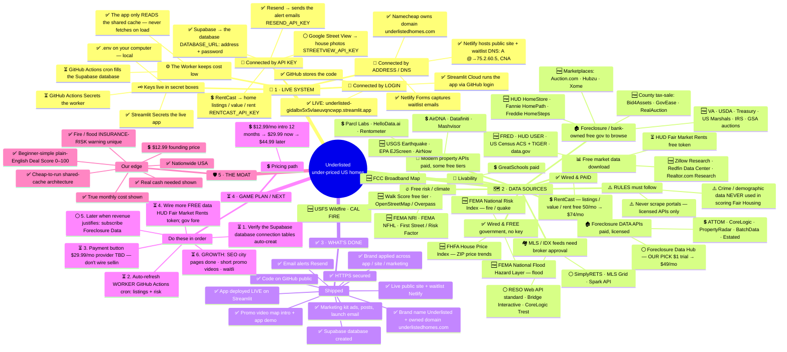

# Underlisted — Master Mind Map

_Center → branches → leaves. Edit `map_gen.mjs` and re-run to update this file and the picture._

**Center:** UNDERLISTED — find under-priced U.S. homes

**Legend:** ✅ Built / live · 🆓 Free source · 💲 Paid · ⏳ Planned next · ⚪ Not yet / parked · ⚠️ Rule / warning

## 🔌 1 · LIVE SYSTEM — _how the apps connect_  (11/15 built)

- **🔑 Connected by API KEY**
  - 💲 RentCast → home listings / value / rent (RENTCAST_API_KEY)
  - ✅ Resend → sends the alert emails (RESEND_API_KEY)
  - ✅ Supabase → the database (DATABASE_URL: address + password)
  - ⚪ Google Street View → house photos (STREETVIEW_API_KEY)  _(PARKED / 403)_
- **👤 Connected by LOGIN**
  - ✅ GitHub stores the code
  - ✅ Streamlit Cloud runs the app (via GitHub login)
  - ✅ LIVE: underlisted-gidalbx5x5vlaeuvqncwpp.streamlit.app
- **📍 Connected by ADDRESS / DNS**
  - ✅ Namecheap owns domain underlistedhomes.com
  - ✅ Netlify hosts public site + waitlist (DNS: A @→75.2.60.5, CNAME www)
  - ✅ Netlify Forms captures waitlist emails
- **🗝️ Keys live in secret boxes**
  - ✅ .env (on your computer — local)
  - ✅ Streamlit Secrets (the live app)
  - ⏳ GitHub Actions Secrets (the worker)
- **⚙️ The Worker (keeps cost low)**
  - ⏳ GitHub Actions cron fills the Supabase database
  - ✅ The app only READS the shared cache — never fetches on load

## 🗺️ 2 · DATA SOURCES — _all over the USA_  (0/25 built)

- **✅ Wired & FREE (government, no key)**
  - 🆓 FEMA National Risk Index — fire / quake
  - 🆓 FEMA National Flood Hazard Layer — flood
  - 🆓 FHFA House Price Index — ZIP price trends
- **✅ Wired & PAID**
  - 💲 RentCast — listings / value / rent (free 50/mo → $74/mo)
- **🏚️ Foreclosure / bank-owned (free gov to browse)**
  - 🆓 HUD HomeStore · Fannie HomePath · Freddie HomeSteps
  - 🆓 VA · USDA · Treasury · US Marshals · IRS · GSA auctions
  - 🆓 County tax-sale: Bid4Assets · GovEase · RealAuction
  - 🆓 Marketplaces: Auction.com · Hubzu · Xome
- **🏚️ Foreclosure DATA APIs (paid, licensed)**
  - ⚪ Foreclosure Data Hub — OUR PICK ($1 trial → $49/mo)  _(not subscribed yet)_
  - 💲 ATTOM · CoreLogic · PropertyRadar · BatchData · Estated
- **📊 Free market data (download)**
  - 🆓 Zillow Research · Redfin Data Center · Realtor.com Research
  - 🆓 FRED · HUD USER · US Census ACS + TIGER · data.gov
  - ⏳ HUD Fair Market Rents (free token)
- **🏘️ MLS / IDX feeds (need broker approval)**
  - ⚪ RESO Web API standard · Bridge Interactive · CoreLogic Trestle
  - ⚪ SimplyRETS · MLS Grid · Spark API
- **🧩 Modern property APIs (paid, some free tiers)**
  - 💲 Parcl Labs · HelloData.ai · Rentometer
  - 💲 AirDNA · Datafiniti · Mashvisor
- **🔥 Free risk / climate**
  - 🆓 FEMA NRI · FEMA NFHL · First Street / Risk Factor
  - 🆓 USGS Earthquake · EPA EJScreen · AirNow
  - 🆓 USFS Wildfire · CAL FIRE
- **🚶 Livability**
  - 🆓 Walk Score (free tier) · OpenStreetMap / Overpass
  - 🆓 FCC Broadband Map
  - 💲 GreatSchools (paid)
- **⚠️ RULES (must follow)**
  - ⚠️ Crime / demographic data NEVER used in scoring (Fair Housing) — info only
  - ⚠️ Never scrape portals — licensed APIs only

## ✅ 3 · WHAT'S DONE — _already built_  (10/10 built)

- **Shipped**
  - ✅ Brand name Underlisted + owned domain underlistedhomes.com
  - ✅ Live public site + waitlist (Netlify)
  - ✅ HTTPS secured
  - ✅ Email alerts (Resend)
  - ✅ Brand applied across app / site / marketing
  - ✅ Marketing kit (ads, posts, launch email)
  - ✅ Promo video (map intro + app demo)
  - ✅ Code on GitHub (public)
  - ✅ App deployed LIVE on Streamlit
  - ✅ Supabase database created

## ⏳ 4 · GAME PLAN / NEXT — _in order_  (0/7 built)

- **Do these in order**
  - ⏳ 1. Verify the Supabase database connection (tables auto-create)
  - ⏳ 2. Auto-refresh WORKER (GitHub Actions cron): listings + risk + market + alert emails, cost-guarded
  - ⏳ 3. Payment button $29.99/mo (provider TBD — don't wire selling without asking)
  - ⏳ 4. Wire more FREE data (HUD Fair Market Rents token; gov foreclosure browse links)
  - ⚪ 5. Later (when revenue justifies): subscribe Foreclosure Data Hub; verify domain in Resend; fix Street View 403
  - ⏳ 6. GROWTH: SEO city pages (done) · short promo videos · waitlist → launch
- **💲 Pricing path**
  - 💲 $12.99/mo intro (12 months) → $29.99 now → $44.99 later

## 🛡️ 5 · THE MOAT — _why we win_  (6/7 built)

- **Our edge**
  - ✅ Beginner-simple plain-English Deal Score 0–100
  - ✅ Fire / flood INSURANCE-RISK warning (unique)
  - ✅ True monthly cost shown
  - ✅ Real cash needed shown
  - ✅ Nationwide USA
  - ✅ Cheap-to-run shared-cache architecture
  - 💲 $12.99 founding price

## Diagram (Mermaid mindmap)



---

### How to refresh the picture
```
node map_gen.mjs
"C:/Program Files (x86)/Microsoft/Edge/Application/msedge.exe" --headless=new --disable-gpu --no-pdf-header-footer --print-to-pdf="<ABS>/IDEA-MAP.pdf" "file:///<ABS>/IDEA-MAP.html"
"C:/Program Files (x86)/Microsoft/Edge/Application/msedge.exe" --headless=new --disable-gpu --hide-scrollbars --window-size=1600,1130 --screenshot="<ABS>/IDEA-MAP.png" "file:///<ABS>/IDEA-MAP.html"
```
