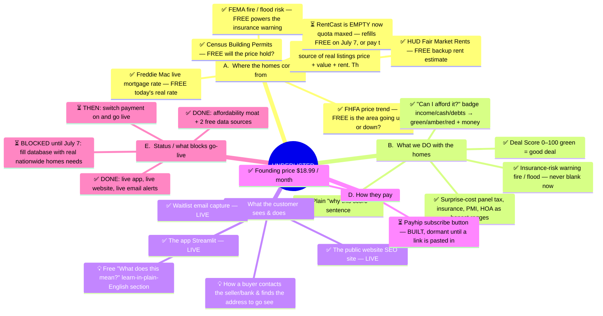

# UNDERLISTED — Project Map

> We tell you which U.S. homes are actually good deals — and why.

**The flow:**  FUEL  (homes in)  →  MAGIC  (we score them)  →  FRONT DOOR  (customer sees)  →  MONEY  (they subscribe)

**Key:**  ✅ done   ⏳ waiting   💡 new idea (being researched)

---

## ⛽ A.  Where the homes come from  —  *the FUEL — no homes, nothing to show*  `(5/7 built)`

- ⏳ RentCast — the PAID source of real listings (price + value + rent). The ONE paid thing.
- ⏳ RentCast is EMPTY now (quota maxed) — refills FREE on July 7, or pay to unlock sooner.
- ✅ FEMA fire / flood risk — FREE (powers the insurance warning)
- ✅ Census Building Permits — FREE (will the price hold?)
- ✅ FHFA price trend — FREE (is the area going up or down?)
- ✅ Freddie Mac live mortgage rate — FREE (today's real rate)
- ✅ HUD Fair Market Rents — FREE (backup rent estimate)

## ✨ B.  What we DO with the homes  —  *the MAGIC / our moat — all FREE math on top*  `(5/5 built)`

- ✅ Deal Score 0–100 (green = good deal)
- ✅ Insurance-risk warning (fire / flood) — never blank now
- ✅ "Can I afford it?" badge (income/cash/debts → green/amber/red + money left each month)
- ✅ Surprise-cost panel (tax, insurance, PMI, HOA) as honest ranges
- ✅ Plain "why this score" sentence

## 🚪 C.  What the customer sees & does  —  *the FRONT DOOR*  `(3/5 built)`

- ✅ The app (Streamlit) — LIVE
- ✅ The public website (SEO site) — LIVE
- ✅ Waitlist email capture — LIVE
- 💡 How a buyer contacts the seller/bank & finds the address to go see the home
- 💡 Free "What does this mean?" learn-in-plain-English section

## 💳 D.  How they pay  —  *the MONEY*  `(1/2 built)`

- ⏳ Payhip subscribe button — BUILT, dormant until a link is pasted in
- ✅ Founding price $18.99 / month

## 🚦 E.  Status / what blocks go-live  —  *where we are right now*  `(2/4 built)`

- ✅ DONE: affordability moat + 2 free data sources
- ✅ DONE: live app, live website, live email alerts
- ⏳ BLOCKED until July 7: fill database with real nationwide homes (needs RentCast)
- ⏳ THEN: switch payment on and go live

---

## Diagram (auto-preview)

*This file is auto-generated by `map_gen.mjs`. To change the map, edit the data in that file and run `node map_gen.mjs`.*
